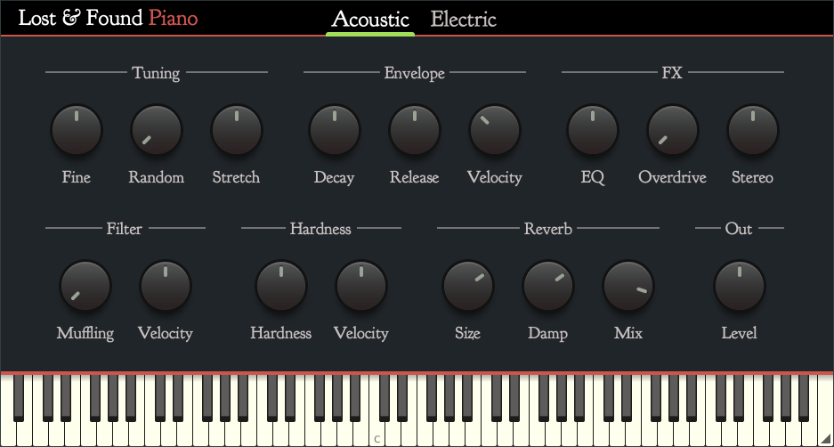

# Lost N' Found Piano

This is the source code for **Lost N' Found Piano**, a virtual instrument plug-in that combines updated versions of the classic **mda Piano** and **mda EPiano** VSTs and gives them a new coat of paint.



mdaPiano is a sampled acoustic piano, mdaEPiano is a Rhodes electric piano. Both were quite popular free virtual instruments back in the early 2000s. The reverb effect is from **mda Ambience**.

**Lost N' Found Piano** mostly exists for nostalgic reasons and because the old VSTs don't work very well on modern computers anymore. It may not be the best sounding piano in the world, but it's still fun to play!

## Installation instructions

Download the latest version from the [Releases page](https://github.com/hollance/lost-and-found-piano/releases).

Extract the downloaded ZIP file.

On Mac:

- copy **Lost N' Found Piano.component** to the folder **/Library/Audio/Plug-Ins/Components**
- copy **Lost N' Found Piano.vst3** to the folder **/Library/Audio/Plug-Ins/VST3**

On Windows:

- sorry, the Windows build is not available yet

<!--
- copy **Lost N' Found Piano.vst3** to the folder **C:\Program Files\Common Files\VST3**
-->

In your DAW, look for **Lost N' Found > Piano**. You can insert this plug-in on an instrument track.

Mac users: If the AU version of the plug-in does not appear in your DAW, go to **Applications/Utilities/Terminal** and type `killall -9 AudioComponentRegistrar` on a single line and press enter. Then restart your DAW.

Refer to **UserGuide.pdf** for usage instructions.

## Known limitations

- None of the original factory presets are included yet.
- The window size is not remembered when you close the plug-in.
- The parameters are not smoothed, so changing them when sound is playing will produce zipper noise.
- These plug-ins were designed for a sample rate of 44.1 kHz. Other sample rates may not work very well.
- There is currently no Windows version.

## Building from source code

**Lost N' Found Piano** is written using C++ and JUCE 8.

This project uses CMake. It assumes a global installation of JUCE.

On macOS:

```bash
cmake -B build -G Xcode -D"CMAKE_OSX_ARCHITECTURES=arm64;x86_64"
```

Then open **build/LostAndFoundPiano.xcodeproj** in Xcode and build the VST3 and/or AU targets.

On Windows:

```text
cmake -B build -G "Visual Studio 17 2022"
```

Then open **build/LostAndFoundPiano.sln** in Visual Studio and build the VST3 project.

## Credits & license

Copyright (c) 2025 M.I. Hollemans

This program is free software: you can redistribute it and/or modify it under the terms of the [GNU General Public License](https://www.gnu.org/licenses/gpl-3.0.en.html) as published by the Free Software Foundation, either version 3 of the License, or (at your option) any later version.

The [original source code](https://sourceforge.net/projects/mda-vst/) for mdaPiano, mdaEPiano, and mdaAmbience is Copyright (c) 2008 Paul Kellett and is licensed under the terms of the MIT license. For this project, I used the [JUCE version](http://github.com/hollance/mda-plugins-juce) of MDA.

JUCE is copyright © Raw Material Software.

VST® is a trademark of Steinberg Media Technologies GmbH, registered in Europe and other countries.

The fonts used are licensed under the SIL Open Font License:

- [Goudy Bookletter 1911](https://github.com/theleagueof/goudy-bookletter-1911). Copyright (c) 2009, [Barry Schwartz](http://www.crudfactory.com)
- [Victor Mono](https://rubjo.github.io/victor-mono/). Copyright (c) 2022, [Rune Bjørnerås](https://github.com/rubjo)
